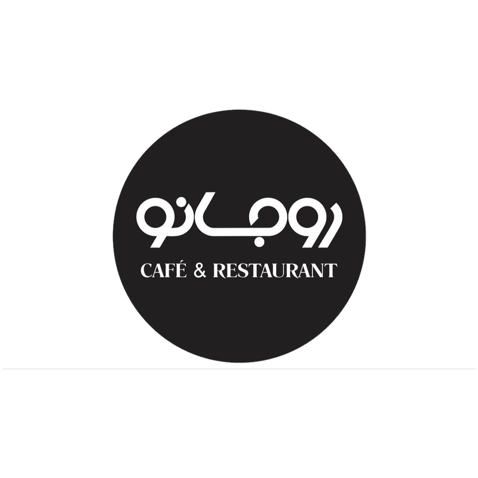

# منوی دیجیتال روجانو

## ساختار پوشه
```
rojano-menu/
 ├── index.html                          ← ظاهر و انیمیشن صفحه (کاری باهاش نداشته باش)
 ├── menu-data.js                        ← همه‌ی قیمت‌ها و اسم آیتم‌ها اینجاست، راحت خودت ویرایشش کن
 └── images/
      └── image-filenames-guide.txt      ← لیست اسم دقیق عکس هر آیتم
```

## ۰) تغییر قیمت‌ها — بدون هیچ برنامه‌ای (پیشنهاد اصلی)
فایل `edit-menu.html` رو مستقیم با مرورگر گوشی یا کامپیوترت باز کن (دابل‌کلیک، یا اگه هاست کردی همین فایل رو هم می‌تونی به آدرست اضافه کنی و از اونجا بازش کنی، مثلاً `rojano-menu.netlify.app/edit-menu.html`). یه فرم می‌بینی با اسم/قیمت/توضیحات همه‌ی آیتم‌ها — هرکدوم رو خواستی تغییر بده، بعد پایین صفحه بزن روی **«دانلود menu-data.js جدید»**. یه فایل جدید برات دانلود میشه؛ همون رو جایگزین `menu-data.js` قبلی کن (کنار `index.html`)، و کل پوشه رو دوباره توی Deploys نتلیفای بنداز. همین.

## ۰.۵) تغییر قیمت‌ها — روش دستی (اگه ویرایشگر متن داری)
فایل `menu-data.js` رو با VS Code (یا حتی Notepad) باز کن. هر آیتم یه خط شبیه این داره:
```
["chicken-alfredo","چیکن آلفردو",685000,"پنه، مرغ، سس آلفردو..."],
```
فقط عدد قیمت (اینجا `685000`) رو به عدد جدید تغییر بده و فایل رو ذخیره کن. راهنمای کامل‌تر بالای خود فایل `menu-data.js` نوشته شده.
در هر دو روش، بعد از تغییر، فایل‌ها رو دوباره کنار هم (کنار `index.html` و پوشه‌ی `images`) توی Deploys آپلود کن.

## ۱) اضافه کردن عکس‌ها (با VS Code)
1. پوشه `rojano-menu` رو با VS Code باز کن.
2. فایل `فایل‌های-موردنیاز.txt` داخل `images` رو باز کن — اسم دقیق فایلِ هر آیتم اونجا نوشته شده (مثلاً `classic-burger.jpg`).
3. عکس هر غذا رو با همون اسم دقیق (حروف کوچک، همون پسوند jpg) داخل پوشه‌ی `images` بریز.
4. لازم نیست چیزی توی کد تغییر بدی — صفحه خودش عکس رو پیدا می‌کنه. اگه عکسی نباشه، به‌جاش یه پس‌زمینه‌ی خاکستری ساده نشون داده میشه و چیزی خراب نمیشه.

> اگه خواستی اسم فایل‌ها رو خودت انتخاب کنی، فقط باید توی `index.html` مقدار `images/اسم-فایل.jpg` رو برای همون آیتم پیدا و ویرایش کنی (جستجو با Ctrl+F).

## ۱.۵) عکس پیتزای صفحه اول
عکسی که فرستادی الان به اسم `images/pizza-hero.jpg` توی پروژه هست و همون چیزیه که تکه‌تکه میشه. اگه خواستی عوضش کنی، فقط یه عکس مربعی (پیتزا از بالا، وسط‌چین) با همین اسم جایگزینش کن.

> یه نکته: اگه این عکس رو از یه سایت استوک (مثل Unsplash) گرفتی، قبل از استفاده‌ی تجاری (روی منوی رستوران) بهتره مجوز/لایسنسش رو چک کنی — بعضی سایت‌ها استفاده‌ی تجاری رو رایگان اجازه میدن، بعضی‌ها نه.

## ۲) اضافه کردن لوگوی واقعی روجانو
فعلاً به‌جای لوگو، خود کلمه‌ی «روجانو» با تایپوگرافی طراحی شده. اگه فایل لوگو (png با پس‌زمینه شفاف) رو بفرستی برام جایگزینش می‌کنم، یا خودت می‌تونی توی `index.html` دنبال این خط بگردی:
```html
<div class="logo-word">روجانو</div>
```
و به‌جاش بذاری:
```html

```
(و فایل `logo.png` رو هم داخل پوشه‌ی `images` بذار)

## ۳) تست روی سیستم خودت
فقط کافیه فایل `index.html` رو توی مرورگر باز کنی (دابل‌کلیک). چون از فونت گوگل استفاده شده، برای دیدن فونت درست باید اینترنت وصل باشه.

## ۴) میزبانی رایگان (Hosting)
ساده‌ترین راه، **Netlify** هست:
1. برو به [https://app.netlify.com/drop](https://app.netlify.com/drop)
2. کل پوشه‌ی `rojano-menu` رو بکش و بنداز (Drag & Drop) روی صفحه.
3. چند ثانیه بعد یه آدرس مثل `https://rojano-xxxx.netlify.app` بهت میده.
4. (اختیاری) توی تنظیمات سایت می‌تونی آدرس رو به چیز خواناتری مثل `rojano-menu.netlify.app` تغییر بدی، یا دامنه‌ی اختصاصی خودت رو وصل کنی.

گزینه‌های رایگان دیگه: **Vercel** یا **GitHub Pages** — روش مشابهیه، فقط باید پوشه رو به یه ریپازیتوری گیت‌هاب وصل کنی.

## ۵) ساخت کیوآرکد
بعد از گرفتن آدرس نهایی (مثلاً `https://rojano-menu.netlify.app`):
1. برو به یه سایت رایگان مثل [qr-code-generator.com](https://www.qr-code-generator.com) یا [qrcode-monkey.com](https://www.qrcode-monkey.com)
2. آدرس سایتت رو بچسبون و کیوآرکد رو دانلود کن (ترجیحاً فرمت PNG یا SVG با کیفیت بالا برای چاپ روی میز).

هر بار که فایل‌ها رو آپدیت کنی (عکس جدید، آیتم جدید و...)، فقط کافیه دوباره پوشه رو روی Netlify Drop بکشی — آدرس و کیوآرکد همونی که هست می‌مونه و چیزی عوض نمیشه.
